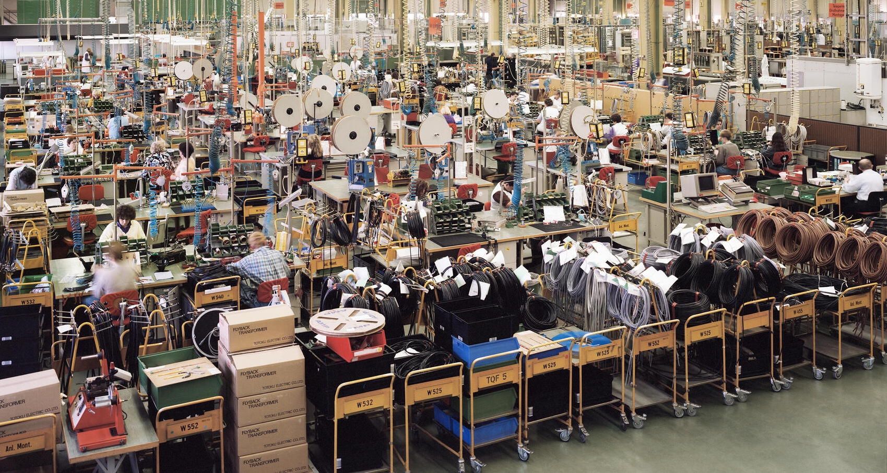

*Andreas Gursky: Siemens, Karlsruhe*

# Economic Growth

Prof: Maria Del Carmen Camacho-Perez ([carmen.camacho@psemail.eu](carmen.camacho@psemail.eu))

Assessment:

- 25% Midterm
- 25% own Project, applying Solow to a topic of our heart
- 50% Final Exam

Quotes:

> Optimal Number of Kids equals 0
>
> Formal:   $N_{kids}^* = 0$
>
> ~ Maria del Carmen Camacho-Perez

