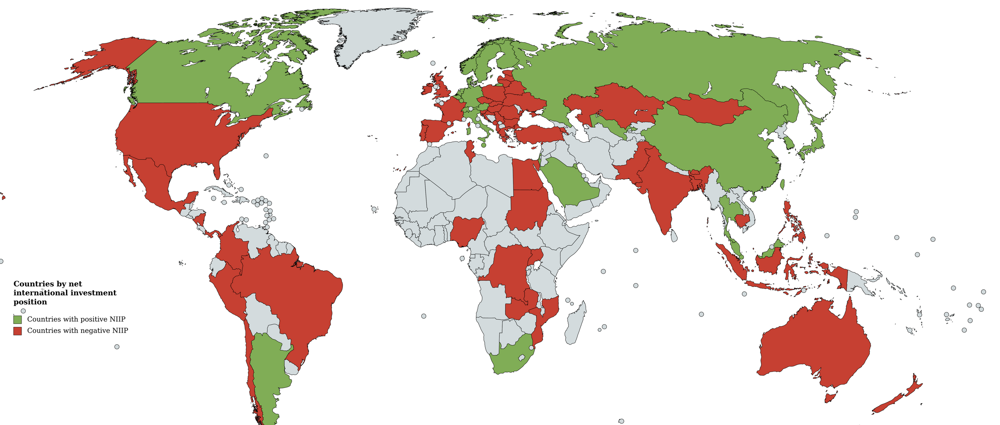

# Macroeconomics: National Accounts

> The System of National Accounts (SNA) is the internationally agreed standard set of recommendations on how to compile measures of economic activity
>
> ~ [UN](https://unstats.un.org/unsd/nationalaccount/sna.asp)

=> oftentimes central indicator of SNA: GDP

## GDP

Calculating GDP:

- **Expenditure** Approach (C+I+G+(X-M))
- **Income** Approach
- **Value-added** approach

measured in:

- *constant* (real) | *current* (nominal) 
- $Dollars | LCU (Local Currency Unites)

Problems with GDP:

- distributional implications
- informal markets
- environmental pollution
- improvements in non-marketable goods
- domestic labour
- distinction between merit / no-merit goods

Alternatives:

- GNI = market value of goods produced by factors of production of country residents
- HDI = Human Development Index
- MPI = Multidimensional Poverty Index
- ...

## Unemployment

Unemployment Rate: Unemployed workers / labour fource

> **Unemployed**: working age, ready and willing to work, actively searching for a job, *unable to find one*

but: its a social construct! (decision on who to include in different categories)

Problems of unemployment:

- idle resources
- deteriation of skills
- social stress!

## Balance of Payments

**Current Account**

= marketed and non-financial

- Goods and services 
- International Income (Wages, Dividends)
- Current Transfers ("money for nothing", e.g Remittances)

**Capital Account + Financial Account** 

- Capital account (intangibles)
- Financial Account
  - Direct investment 
    - Business Investment > 10% size of business
    - Real Estate
    - reinvested profits
  - Portfolio investment (< 10%)
  - Other Investment 
  - Reserve assets (SDR, CB Gold, ...)
- Errors

**Current Account + Capital Account + Financial Account = 0**

Net international investment position = *External Assets - External Debts*

US = needs a negative position to pay for its consumption
