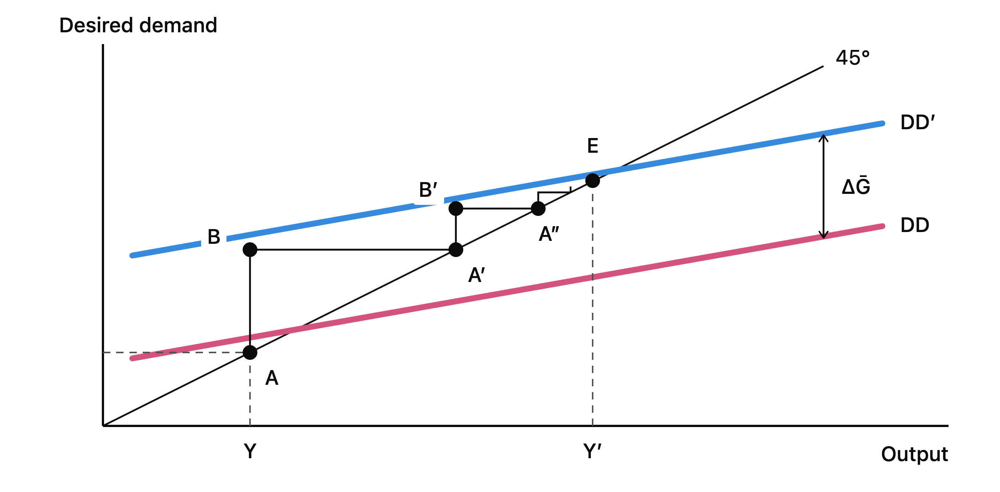
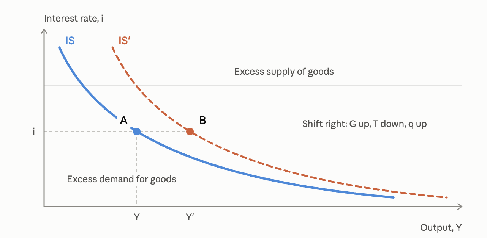
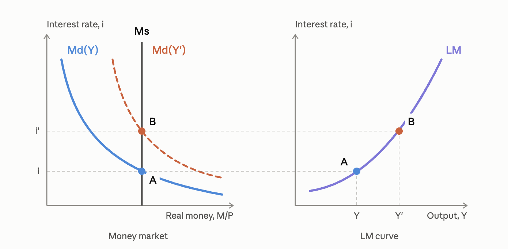

# 30.09.2026 IS-TR model

Background:

- Keynes: General Theory = innovative model of the economy
- Hicks: formalize (one variant) of this model into maths

= pedagogical tool 

> The long run is a misleading guide to current affairs. In the long run were all dead.
>
> ~ KEYNES

Keynesian assumption: **sticky** prices

- fixed in the short run
- nominal phenomena => real effects
- Disturbances => Business Cycle Fluctuations 

## Modeling

Assumptions: 

- General Equilibrium = all markets clear 
- all variables in real terms

Central ID from SNA:

$$
\overbrace{Y}^{agg. supply} = \overbrace{C+I+G+(X-Z)}^{aggregate^\ demand}
$$

=> demand driven equilibrium, we dont care about supply

#### Consumption

$$
C = C(\overset{+}{\Omega}, \overset{+}{Y-\bar{T}})
$$

- $Y-T$ = disposable income = Income - Tax
- $\Omega$ = HH. Wealth

Marginal propensity to consume (MPC) = share of disposable income consumed

#### Investment

$$
I = I(\overset{+}{q}+\overset{-}{r})
$$

- q = Tobin's q $\approx$ Business Expectations
- r = real interest rate

#### Primary Current Account

Import 

$$
Z = Z(\overset{+}{A}, \overset{+}{\sigma})
$$

- A = C+I+G = domestic income
- $\sigma$ = real exchange rate

Export

$$
X = X(\overset{+}{A^*}, \overset{-}{\sigma})
$$

- A* = Foreign Absorption
- $\sigma$ = real exchange rate

A = similar to Y, depends on Y

then Primary Current Account:

$$
PCA = PCA(\overset{-}{Y}, \overset{+}{Y}^*, \sigma)
$$

### Desired Demand

$$
DD = C(\overset{+}{\Omega}, \overset{+}{Y-\bar{T}}) + I(\overset{+}{q}+\overset{-}{r}) + G + PCA = PCA(\overset{-}{Y}, \overset{+}{Y}^*, \sigma)
$$

Note: Y is exogenous in this! (thats why "desired")

Slope: How does change in Y affect DD?

- changes in Consumption and Imports
- marginal propensity to consume $c$
- marginal propensity to import $z$

$$
\Delta DD = (1-z) c \Delta Y
$$

A Shock in Government Spending: 

= Keynesian Multiplier 

## IS Curve

*The Goods market*

Investment = Savings (Accounting Identity from Keynes)

Curve:

- endogenize the nominal interest rate
- $i \uparrow, r \uparrow \implies Tobin's \ q \downarrow Investment \downarrow$
- downward sloping
- X-axis = Output, Y-Axis=Interest rate

Changes:

- Shifts left/Right when at same interest rate = more Y (e.g increase in G)
- move **along** the line when i changes

## LM Curve

*the Money Market*

This Model: Inflation targeting with **Taylor Rule**

- nominal interest rate = function of inflation gap and output rule
- set by Central Bank

$$
i = \bar{i} + b(\frac{Y-\bar{Y}}{Y})
$$

- $\bar{i}$ = natural rate of interest
- $(Y-\bar{Y}/B)$ = output gap
- $b$ = policy relevance of output gap (how active is CB)
- Note: no inflation gap as prices are sticky

= upward sloping (higher output, higher interest rate)

always **ON** the curve!!

## Equilibrium

When?

- Goods market is in equilibrium: Y = DD
- TR holds

= intersection of IS+TR lines 

No excess supply / demand for goods / money

### Shifts

with real disturbances 

- = goods market shocks
- G, T, $\Omega$, q, ...

monetary policy disturbances 

