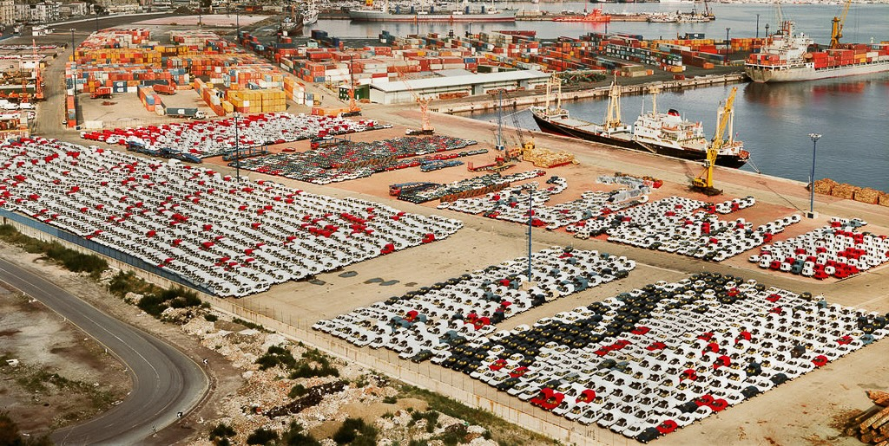

*Andreas Gursky: Salerno*

# Macroeconomics

Prof: Elizaveta Burina ([elizaveta.burina@univ-paris1.fr](elizaveta.burina@univ-paris1.fr))

## Assessment

| Date  | Type                                    | Exam |
| ----- | --------------------------------------- | ---- |
| 05.11 | Commentary on a news article submission | 30%  |
| 17.12 | RBC Python exercise                     | 20%  |
| 13.01 | Exam                                    | 50%  |

Commentary:

- 1000 Word essay
- From the positon of a macroeconomist at IMF etc.
- about self-chosen News item
- Hint: apply a theoretical model and show it does not work in specific context of country XY

Python:

- Maths: Theoretically solve RBC
- Python: implement in RBC
- Product: LaTeX Document

## Literature

- Burda + Charles: "Macroeconomics: A European Text" (**easy intro text**)
- Gali: "Monetary Policy, Inflation and the Business Cycle"
- ...