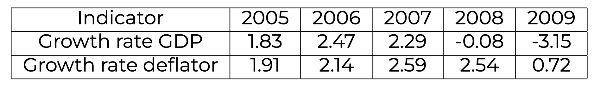
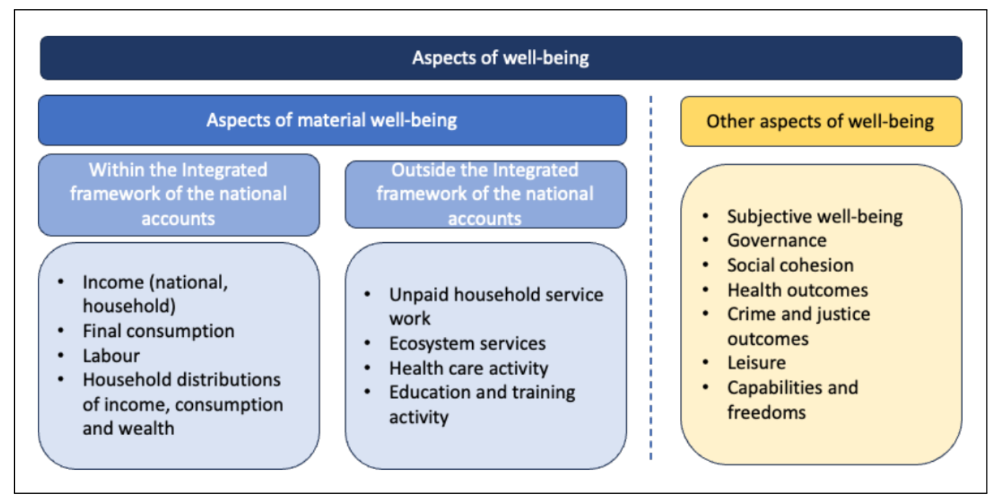

# 21.09.2026 Intro to SNA


## GDP Exercises


```
GDP = 2500
Depreciation = 250
Befre-tax- Corlorpare profits = 500
Social Security contribution
```


- NDP = GDP - Depreciation
- GNI = GDP - Remittances - Net interest to foreigners
- Personal Disposable Income = GNI - Indirect Taxes - Social Sec - Corp. Taxes - Fines and Fees + Transfers 
- Government Purchases = Government Revenue - Government Transfers + Deficit
  - Governemtn Revenue = Taxes + Fines etc
  - Government Transfers = Transfers + Subsidies
- Current Account = Y - C - G - I


### Deflator Exercises

given:

- GDP at current prices in 2005

Calculate without using absolute amounts and without division of numbers
$$
Def_t = \frac{y_t^N}{y_t^R} \\
ln(Def_t) = ln(y_t^N) - ln(y_t^R) \\
\frac{\delta}{\delta t} \implies \frac{\dot{D}}{D} = \frac{\dot{y}^N_t}{y^N_t} - \frac{\dot{y}^R_t}{y^R_t}
$$


From this table:



Real growth rate = growth Rate GDP - Growth Rate Deflator

- Then: $GDP_{2007} = GDP_{2005} * (1+g_{2006})* (1+g_{2007})$


## SNA Update


New feature: **well being** :) 

Well being = subjective and objective aspects
- income, health, knowledge
- self-reported indicators, evaluations

SNA = focus on material (objective) aspects, mainly measuring outputs 


How well being is included:

- supplementary accounts (,
- thematic accounts (more detailed information on specific topic)
- extended accounts (not strictly related to SNA, e.g unpaid household service work




---

**Labour**: new breakdown tables, better included

**Health care**: more thematic tables, if possible other options

**Education:** also more thematic tables

**Unpaid household services:** recommends regular compilation