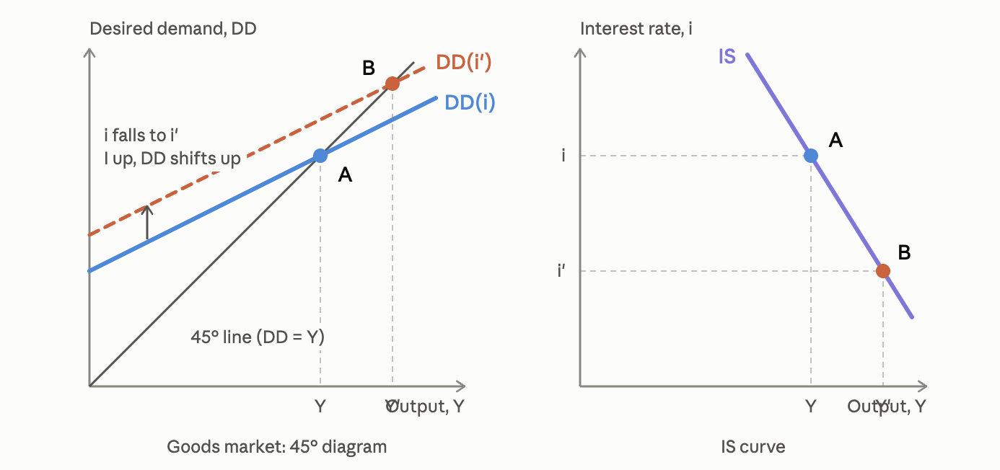

# 05.10.2026 IS-TR Tutorial

## IS

- *Crucial Assumption of IS-LM?* sticky wages

- *How can demand be different from output?* Adjustment of economy = lagging behind demand

> **Desired Demand**: All spending in the economy

$$
DD = \overbrace{C}^{(Y-T ^+, \Omega^+)} + G+\overset{(i^-,q^+)}{C}+\overset{(Y^-, Y_*^+, \sigma^-)}{PCA}
$$

- Tobins q: $\frac{\text{Market value of asset}}{\text{replacement costs}}$, dependent on i
  - higher r => higher replacement cost
  - higher r => higher discount on market values => lower present value
- "animal spirits" / business expectations 

- *Keynesian Multiplier?* A one-off shock has second round effects
  - in the Formula: increase in G => increase in Y => will increase C again => ...

Diagram:

- DD < 45°: because of the Marginal propensity to consume < 1
- IS Curve : derived from a i shock on different outputs

## TR

TR: $i = \bar{i} + b(\frac{Y-\bar{Y}}{Y})$

- i = natural interest rate = target by CB
- $\bar{Y}$ = Trend / potential output

## Exercises

### GDP Calculation Fun

Desired demand is represented by the following function:

$$
DD = Y = 5000 + 0.75(Y − T ) + G − 100i − 1000σ
$$

- Domestic and foreign price levels have been assumed constant and equal to 1.
- Let i = 5% throughout. 
- Initially G = T = 3000, σ is the nominal exchange rate and
  is assumed fixed at 1.

a) T is increased by 500, what happens to Y?

$$
Y-0.75Y = (5000-1000-0.05 \cdot 100) - 0.75T+G \\
Y = 4* [(...)-0.75T+G] \\
\frac{dY}{dT} = 4 \cdot -0.75 = -3
$$

= Tax multiplier is negative 3 * change in T = 500

$$
\frac{dY}{dT} \Delta T = -3*500=-1.500
$$

b) G increased by 500

$$
\frac{dY}{dT} \Delta T = 4*500=2000
$$

c) Net effect = 500

### Fancier Calculation Fun

$$
Y = C_0 + C_1(Y-\bar{T}-t*Y)+G+I+PCA_0-mY
$$

- $T = \bar{T}+t*Y$ : t = exogenous tax rate
- $PCA = PCA_0 + mY$ = import propensity

derive the government spending multiplier:

*Collect and derivative*
$$
Y\underbrace{(1-C_1*1+C_1*t+m)}_{\gamma} = C_0+C_1 \bar{T}+G+I+PCA_0 \\
Y = 1/\gamma * (... )\\
\frac{dY}{dG} = 1 /\gamma
$$
Derive the IS Curve with $I=\bar{I}-20i$
$$
Y = \frac{
\overbrace{C_0+C_1 \bar{T}+G+PCA_0}^{=\alpha}
+\overbrace{\bar{I}-20i}^{=I}
}
{\gamma} \\
 = \frac{\alpha}{\gamma}- \frac{20}{\gamma}* i
$$

### Taylor rules!

TR: $i = 5+0.5(Y-\bar{Y})$

Increase in $\bar{i}$ : move the TR line upward

Equilibrium: 
$$
i = 5+0.5(Y-\bar{Y})\\
Y = \frac{\alpha}{\gamma} - \frac{20}{\gamma} i  \\
\implies
Y = \frac{\alpha}{\gamma} - \frac{20}{\gamma} [5+0.5(Y-\bar{Y})] \\
Y + \frac{10}{\gamma}Y = \frac{\alpha}{\gamma} - \frac{20}{\gamma} [5+0.5Y] \\
Y (\frac{\gamma+10}{\gamma}) = ... \\
Y = (\frac{\gamma+10}{\gamma})[\frac{\alpha}{\gamma}-\frac{20}{\gamma} (5+0.5Y)] \\
\text{into i=}
$$
