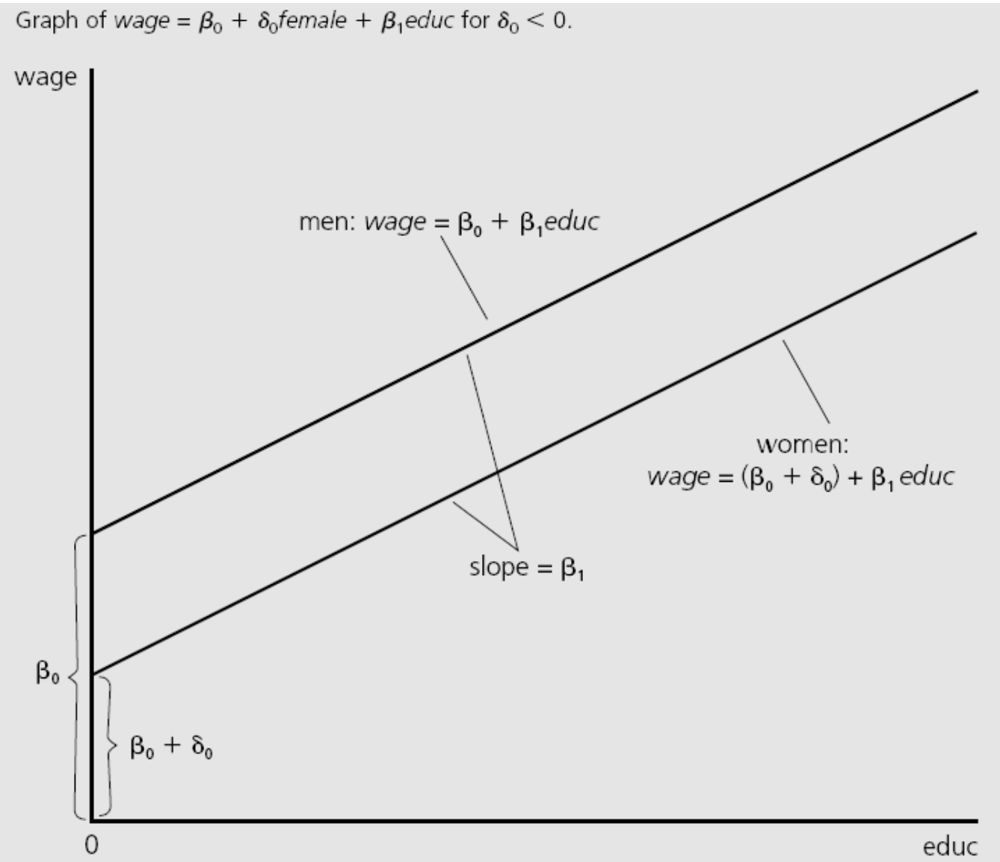

# 29.09.2026 OLS II

## Variance

Empirical Variance of $y_i$

$$
Var_N(y_i) = Var_N(\hat{y}_i+ \hat{u}_i) + \overbrace{Cov_N(\hat{y}_i+ \hat{u}_i)}^{=0}
$$

> **ANOVA** Total Variance = variance explained + unexplained

- **Total** Sum of Squares (TSS): $Var(y_i) = \sum(y_i - \bar{y})^2$
- **Explained** Sum of Squares (ESS): $Var(y_i) = \sum(\hat{y}_i - \bar{y})^2$
- **Residual** Sum of Squares (SSR): $Var(y_i) = \sum(\hat{u_i})^2$

TSS = ESS + SSR

### R-squared

$R^2$ = Explained / Total = determines the model fit 

$$
R^2 = \frac{ESS}{TSS} = 1 - \frac{SSR}{TSS} \\
= \frac{\frac{1}{n}\sum (X_i \beta_i-\bar{y})^2}{Var(y)} \\
R^2 \in [0,1]
$$

**adjusted** $R^2$

- in a multiple regression, more coefficients = automatic increase in R^2
- adj. adjusts for that and calculates a more realisitc model fit

$$
adj. \ R^2 = 1- \frac{SSR / (n-K-1)}{TSS/(n-1)}
$$

## Interpretation

- $\hat{\beta_1} = \Delta \hat{y} / \Delta x$
- $\Delta \hat{y} = \hat{\beta_1} * \Delta x$
- ceteribus paribus (other factors fixed)

*"if you increase x by one unit, what happens to y?"*

### Dummy Variables

- for discrete values (e.g sex)
- takes value 0 or 1

changes the intercept, not the slope!

### Transformations

#### measurment units (x)

$y = \beta_0 + \beta_1 x_1 + \epsilon$

Now: $x_1^* = c x_1$

- $y = \beta_0 + \beta_1 \bold{c} \ x_1 + \epsilon$
- all coefficients stay the same
- EX.: Dollar to cents etc.

#### measurment units (y)

New: $y^* = c \cdot y$

- $c \cdot y = c \cdot \beta_0 + c \cdot \beta_1 x_1 +c \cdot  \epsilon$
- Multiply all coefficients: $\beta_1^* = c \cdot \beta_1$

#### Logarithms

Reminder: $10^3=1000 \implies log_{10}(1000) = 3$

- asymptotic: never reaches zero 
- $log(a*b) = log(a) + log(b)$
- $log(a/b) = log(a) - log(b)$

Small changes: 

- $\Delta log(x) = log(x_1) - log(x_0) \approx \Delta x / x_0$
- $100 \Delta log(x) = \Delta % x$

Interpretations:

| Model      | Formula                        | Interpretation                                |
| ---------- | ------------------------------ | --------------------------------------------- |
| Linear     | $y = ... + \beta x$            | 1 unit of x -> $\beta$ unit change in y       |
| Log-Linear | $log (y) = ... + \beta x$      | 1 unit of x -> $100\cdot \beta$ % change in y |
| Linear-Log | $y = \beta log(x)$             | 1 % change in x -> $\beta/100$ change in y    |
| Log-Log    | $log (y) = ... + \beta log(x)$ | 1% change in x -> $\beta$ % change in y       |

Why Log?

- more variance in lower / middle part of the distribution (e.g wages)
- extreme values dont influence as much
- independent of units

## Non-Linearities

Modelling a non-linear model, e.g wage and age

- higher age = more wage
- but decreasing 

$$
y = a + b_1 x  + b_2 x^2
$$

## Interactions

Sometimes, two variables may be related and interact
$$
y = a + b_1 x  + b_2 x \cdot y
$$
E.g Returns to Education (split by sex)
$$
\ln wage = \beta_0 + \beta_1 educ + \beta_2 sex + \beta_3 educ*sex
$$

- $\beta_1$ = average returns to education for men (reference group)
- $\beta_1 + \beta_3$ = average returns to education for women
- $\beta_3$ = absolute differences in returns (*without any control variables*)
- $\beta_2$ = average wage difference *with no education*

 
