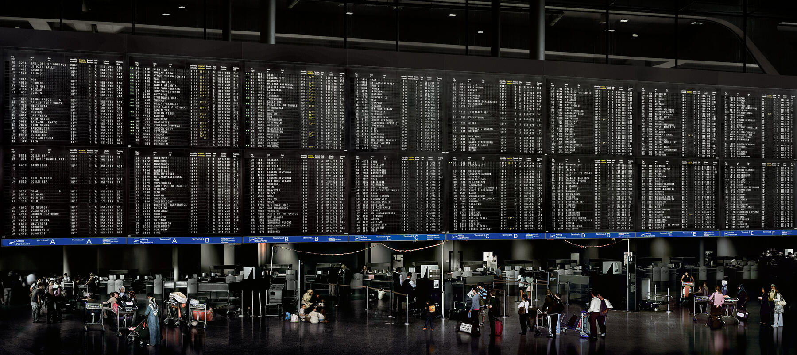

*Andreas Gursky: Frankfurt Airport*

# Econometrics

Prof: [Morgane Laouenan](https://sites.google.com/site/morganelaouenan/)

Assessment:

- Written Exam: 50% (**12.01.27**)
- Group Projects (2-3 people)

Objectives: increase understanding of applied metrics (examples)

- Examples from papers
- identification / variation

NOTE: Read papers / book chapters each week!

