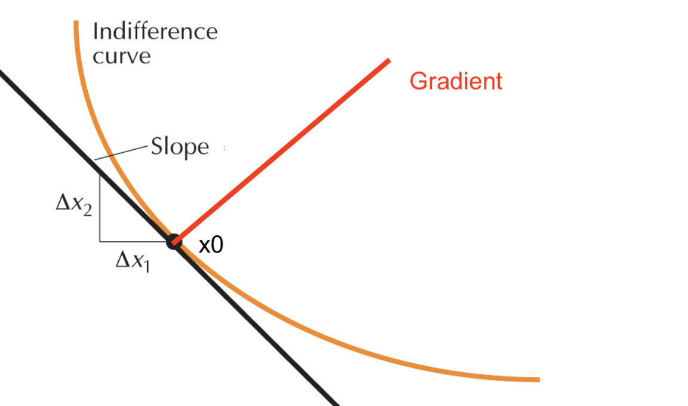

# 17.09.2026 Constrained Optimization 

### Maths Refresh

Geometric Interpretaion of Gradient

- Rate of change of $u(x_1,x_2)$ 
- at point $x^*$
- in direction $v=(v_1,v_2)$

$$
x = x^* + tv, t \in R \\
g(t) = u(x^* + tv) = u(x_1^* + tv_1. x_2^*+tv_2) \\
$$

Derive (Vector Multiplication)
$$
g'(0) = (
\frac{\delta u}{\delta x_1}(x^*) \ \ \
\frac{\delta u}{\delta x_2}(x^*) )
\binom{v_1}{v_2} =
D u(x^*)v
$$
This is the gradient: $Du(x^*) = \nabla u(x^*)$ 

- A column vector!
- rate of change along direction $v$

Another way to write: 
$$
\nabla u(x^*) v = 
\begin{bmatrix}
\frac{\delta u (x^*)}{\delta x_1} \\
\frac{\delta u (x^*)}{\delta x_2}
\end{bmatrix} \times \begin{bmatrix}
v1 \\ v2 
\end{bmatrix}
$$
To maximize: 

- Gradient and v should point in same direction
- Aka Gradient is the direction to go
- except if Gradient = 0 in both directions

**Dinis Theorem**

- Take a point: $u(x_1^0,x_2^0) = c$
- There is the level curve in proximity: $u(x_1,x_2) = c$    (think IDK)

Then we can express $x_2$ as $x_1$: $f (x_2) = f(x_1)$

$$
u(x_1, f(x_1)) = c \\
f(x_1^0) = x_2^0 \\
f'(x_1) = - \frac{
\frac{\delta u}{\delta x_1}(x_1^0, x_2^0)}
{
\frac{\delta u}{\delta x_1} (x_1^0, x_2^0)
}
$$

Applied: Slope of the tangent on Indifference Curve around Point 

Now: Gradient of Function = orthogonal to level curve

$$
\nabla u(x_1^0, x_2^0) \ \bot \ u(x_1^0, x_2^0) = c
$$

To get that with matrices (Dot Product)

$$
\underbrace{\begin{bmatrix}
\frac{\delta u}{\delta x_1}(x_1^0, x_2^0) \\
\frac{\delta u}{\delta x_2}(x_1^0, x_2^0)
\end{bmatrix}}_{Gradient}
\cdot
\underbrace{\begin{bmatrix}
1 \\
- \frac{
\frac{\delta u}{\delta x_1}(x_1^0, x_2^0)}
{
\frac{\delta u}{\delta x_1} (x_1^0, x_2^0)
}
\end{bmatrix}}_v
= 0
$$

### Constrained Optimization Example

Problem

$$
\max u(x_1,x_2) \; s.t. \ h(x_1,x_2) \le b
$$

Lagrange Function:

$$
L = u(x_1,x_2) - \lambda[h(x_1,x_2)-b]
$$

To Solve: 

$$
\left\{ 
\begin{array}{l}
\frac{\delta L}{\delta x_1}(x^*) &= 0 \\
\frac{\delta L}{\delta x_2}(x^*) &= 0 \\
\frac{\delta L}{\delta \lambda^*} &= 0 \\
\lambda^* &\ge 0
\end{array}
\right.
$$

### Kuhn-Tucker

Now: with new constraints 
$$
\max u(x_1,x_2) \\ s.t. \ h(x_1,x_2) \le b \\
x_1 \ge 0; x_2 \ge 0
$$
New Complimentary Conditions :) 
$$
\left\{ 
\begin{array}{l}
\frac{\delta L}{\delta x_1}(x^*) &= 0 \\
\frac{\delta L}{\delta x_2}(x^*) &= 0 \\
\frac{\delta L}{\delta \lambda^*} &= 0 \\
\text{Complimentary Conditions:}\\
x_1 \cdot  \frac{\delta L}{\delta x_1}(x^*)&= 0 \\
x_2 \cdot  \frac{\delta L}{\delta x_2}(x^*)&= 0 \\
\lambda \cdot  \frac{\delta L}{\delta \lambda}(x^*)&= 0 \\
\lambda^* &\ge 0
\end{array}
\right.
$$

### Duality of Problems

$$
\max u() \; s.t \;  h() \le b \\
\implies \\
\min h() \; s.t. \; u() \ge b
$$

If target function is linear, this plays a role!

### Envelope Theorem

- If we have a function with a parameter: $f(x;a)$
- we find an optimum $x^*(a)$
- we plug that back in

$$
V(a) = f(x^*(a), a)
$$

Now derive:

$$
\frac{dV}{da}
=
\frac{\partial f}{\partial x}
\frac{dx^*}{da}
+
\frac{\partial f}{\partial a}
$$
Easy fix: $\frac{\partial f}{\partial x}=0$
$$
\frac{dV}{da} = \frac{\partial f}{\partial a}
$$
Easy fix for that one
