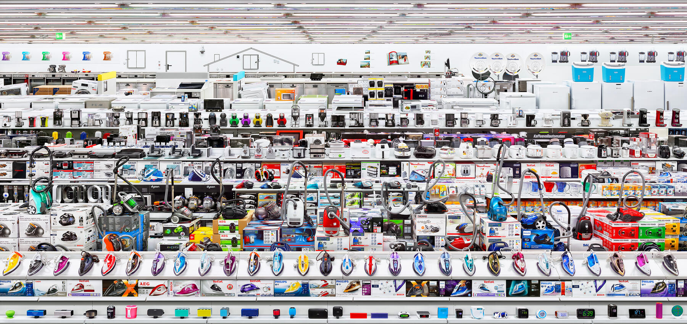

*Andreas Gursky: Mediamarkt*

# Microeconomics

Prof: Angelo Secchi ([angelo.secchi@univ-paris1.fr](mailto:angelo.secchi@univ-paris1.fr))

- put [MICRO] in the Subject
- remind after 48 hours
- meeting right before / after class

[EPI](https://cours.univ-paris1.fr/course/view.php?id=50943)

### Readings

- Jehle and Reny: Advanced Microeconomic Theory
- Osborne and Rubinstein: Models in Microeconomic Theory
- Advise: READ THE CHAPTERS!

### Assessment

- 50% Midterm Exam: Combination of last years exams (05.11, 3h)
- 50% Final Exam

